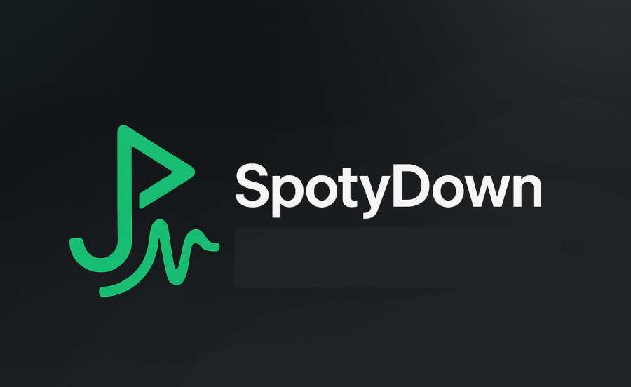
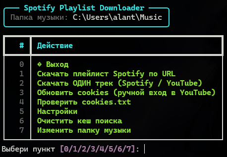

<!-- Banner / Title -->

  

<h1 align="center">SpotyDown</h1>

скачивай треки и плейлисты — красиво, с тегами и обложками

  
  
  </a>
  </a>

---

## ✨ Возможности

- 📥 **Плейлисты из Spotify**  
  Вставляешь ссылку на плейлист — приложение ищет соответствия на YouTube и скачивает все треки.

- 🎯 **Один трек — двумя способами**  
  • по ссылке **Spotify** (умный подбор версии на YouTube)  
  • по прямой ссылке **YouTube**.

- 🏷️ **Автотеги + обложка**  
  Проставляем `title / artist / album` и встраиваем обложку.  
  Превью YouTube и обложки Spotify приводятся к **JPEG 640×640 (baseline)** — так их корректно видит большинство плееров.

- ⚙️ **Понятные настройки**  
  Формат: **MP3** или **FLAC**; для MP3 — **160/320 kbps**; число потоков; переключатель **DEBUG**.  
  Все настройки сохраняются между запусками.

- 📁 **Папка музыки — один раз и навсегда**  
  При первом запуске — системный диалог выбора папки. Потом всё запоминается (и всегда можно сменить в меню).

- 🍪 **Помощник с cookies YouTube**  
  Для роликов с возрастными ограничениями/доступом: встроенный помощник (Selenium) сохранит `cookies.txt`.

---

## 🖼️ Скриншоты

| Главный экран |
|---|
|  |

---

## 🧠 Как это работает (в 4 шага)

1) Получаем метаданные из Spotify (название, артист, альбом, длительность, обложка).  
2) Ищем на YouTube лучшую версию трека по названию/артисту/длительности.  
3) Скачиваем аудио через `yt-dlp` в выбранном формате (**MP3** или **FLAC**).  
4) Проставляем теги и **встраиваем обложку** (нормализованную под плееры: JPEG 640×640 baseline).

---

## 🔐 Приватность

- Всё происходит локально на твоём компьютере.  
- `cookies.txt` (если используешь) лежит рядом с программой и никуда не отправляется.  
- Настройки и путь к «папке музыки» сохраняются в конфиге пользователя.

---

## ⚠️ Дисклеймер

- Проект предназначен **для личного использования**. Уважай права правообладателей.  
- YouTube не отдаёт «lossless» звук. При выборе **FLAC** качество не становится «магически без потерь» — это удобный контейнер.  
- Контент с DRM/ограничениями может быть недоступен.

---

## 🗺️ Дорожная карта

- [x] Скачивание одного трека  
- [x] Скачивание плейлистов Spotify  
- [x] Обложки JPEG 640×640  
- [ ] Релиз Windows `.exe` (v1.0)  
- [ ] Улучшение поиска треков  
- [ ] Скачивание из ЯМузыки  
- [ ] Новые форматы/опции

---

## ⬇️ Скачать

Готовые сборки для Windows появятся на странице **Releases**:  
**➡︎ https://github.com/AlanMute/spotydown/releases**

> Как только будет готов `.exe`, здесь будет прямая ссылка на последний релиз.

---

## 🙌 Благодарности

- [yt-dlp](https://github.com/yt-dlp/yt-dlp) — скачивание YouTube  
- [Rich](https://github.com/Textualize/rich) — красивое терминальное UI  
- [Spotipy](https://github.com/spotipy-dev/spotipy) — Spotify API  
- [Mutagen](https://github.com/quodlibet/mutagen) — теги  
- [Pillow](https://python-pillow.org) — обработка изображений  
- [Selenium](https://www.selenium.dev/) + undetected-chromedriver — хелпер для cookies

---

## 🪪 Лицензия

MIT — см. файл [LICENSE](LICENSE).
